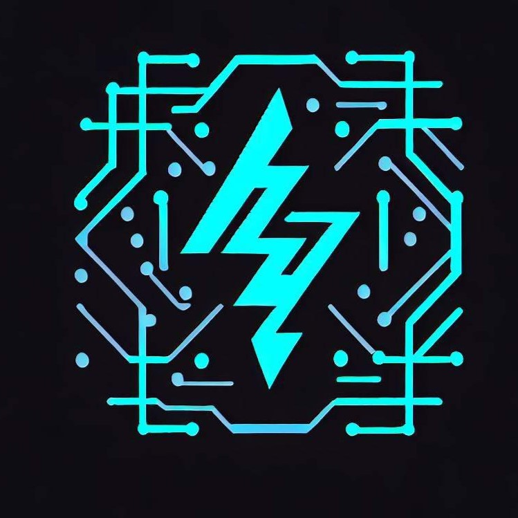
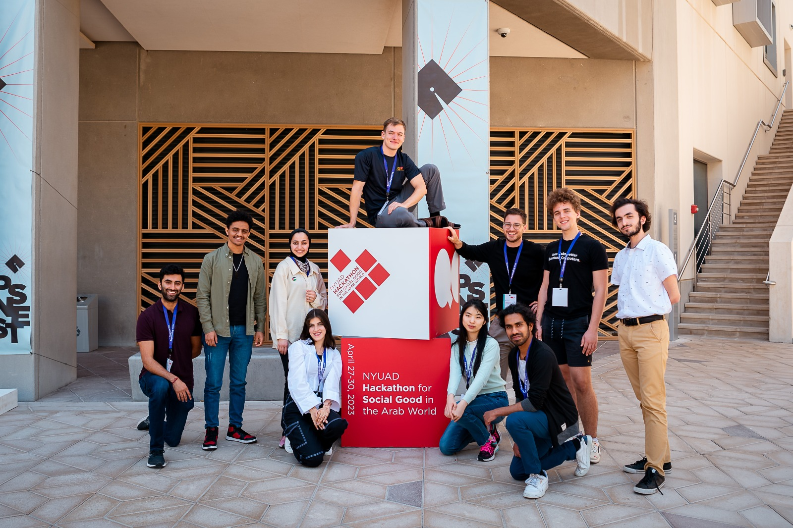

<h1 id="sample-markdown" text-align: center>
  Smart Current: Blackouts are not just an inconvenience
</h1>

  

  http://smartcurrent.org

## Project Description

Smart Current utilizes quantum computing to reduce the issue of power outages by utilizing quantum-enhanced GNNs and quantum extracted topological features to manage power flow and avert blackouts.

## Our Approach

An algorithm has been developed to analyze power grids and monitor their stability in real-time. The algorithm identifies the topology of a power grid and analyzes node parameters such as power output and consumption to determine its stability. The primary objective of this algorithm is to detect any issues in real-time to prevent power grid failure.

The classical algorithm works by finding the topological values associated with every node's two-hop neighborhood (all the nodes and connections within two steps of every node). This is done by running a topological data analysis (TDA) algorithm on every node's neighborhood, which identifies topological features such as holes and manifolds. This is added as a parameter to every node, so that we have information about every node's neighborhood. Then, a GNN (graph neural network) is run to identify how stable a power grid is. A graph neural network takes in a graph as input, so it is very practical for the use case of power grid analysis. 

The classical algorithm runs in super-polynomial time, meaning it is very slow for large power grids. For the power grid analysis to be run in real-time, every check of the power-grid requires a topological analysis, so an improvement to the topological analysis is desired. In other words, we need to speed-up our analysis and remain accurate. 

## The Team

  

